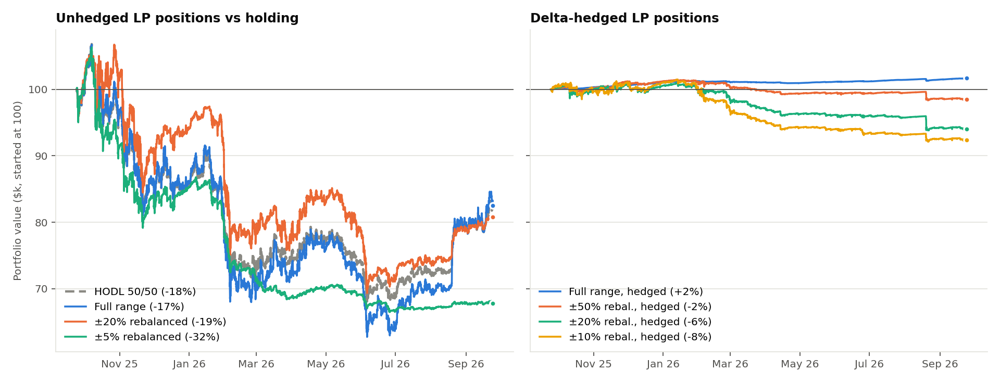
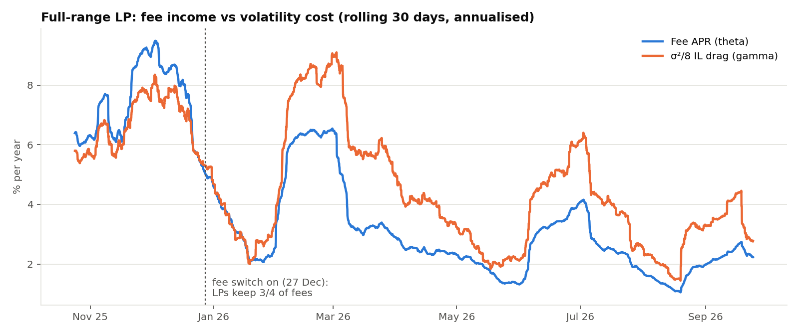
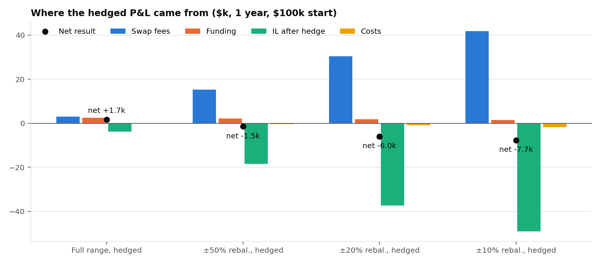

# Uniswap LP Project

**Is providing liquidity on Uniswap actually profitable once you strip out the ETH bet?**

This project rebuilds the Uniswap v2 and v3 swap math from the Solidity
contracts and checks it against real mainnet swaps, where it matches exactly.
It then backtests 13 liquidity-provider strategies over a full year of hourly
on-chain data from the USDC/WETH 0.05% pool, with and without a delta hedge
on a perp.

Everything here comes from public Ethereum RPC calls and the Hyperliquid API.
Only `requests`, `numpy`, `pandas` and `matplotlib` are used; there's no web3
library and no subgraph.

---

## Headline results (24 Sep 2025 → 24 Sep 2026, $100k per strategy)

ETH fell from **$4,183 to $2,641 (−37%)**, with **61%** realised volatility.

| Strategy | Return | Fee APR | Fees $ | Hedge + funding $ | Costs $ | Rebal. | Ann. vol | Max DD |
|---|---:|---:|---:|---:|---:|---:|---:|---:|
| HODL 50/50 | -18.4% | 0.0% | 0 | 0 | 0 | 0 | 23.2% | -36.2% |
| Full range | -17.5% | 3.1% | 3,064 | 0 | 0 | 0 | 29.8% | -41.2% |
| ±50% static | -20.7% | 9.1% | 9,059 | 0 | 0 | 0 | 49.2% | -53.7% |
| ±20% static | -26.0% | 7.8% | 7,818 | 0 | 0 | 0 | 51.7% | -57.2% |
| ±10% static | -24.0% | 11.3% | 11,349 | 0 | 0 | 0 | 49.7% | -56.2% |
| ±50% rebalanced | -26.3% | 15.3% | 15,255 | 0 | 61 | 3 | 33.9% | -42.5% |
| ±20% rebalanced | -19.2% | 30.4% | 30,406 | 0 | 179 | 9 | 26.7% | -35.0% |
| ±10% rebalanced | -30.2% | 41.8% | 41,762 | 0 | 667 | 38 | 21.8% | -40.9% |
| ±5% rebalanced | -32.2% | 58.7% | 58,737 | 0 | 1,839 | 134 | 16.6% | -37.5% |
| **Full range, hedged** | **+1.7%** | 3.1% | 3,064 | 19,243 | 96 | 0 | **0.4%** | **-0.3%** |
| ±50% rebal., hedged | -1.5% | 15.3% | 15,255 | 25,184 | 474 | 3 | 2.2% | -3.1% |
| ±20% rebal., hedged | -6.0% | 30.4% | 30,406 | 14,058 | 995 | 9 | 4.1% | -7.0% |
| ±10% rebal., hedged | -7.7% | 41.8% | 41,762 | 23,600 | 1,726 | 38 | 4.7% | -9.2% |



### What the numbers say

1. **An LP position is short volatility.** With the hedge taking out the ETH
   direction, what's left is fee income (theta) against impermanent loss
   (gamma). For a full-range position the expected loss is about **σ²/8 per
   year**, the same quantity as *loss-versus-rebalancing* (LVR, Milionis et
   al. 2022). At 61% realised vol that comes to **4.7% a year**. Full-range
   LPs earned **3.1%**, so fees alone didn't cover the volatility.
2. **The only positive strategy was the hedged full range (+1.7%, 0.4% vol),
   and funding carried it.** Shorting the ETH perp earned **6.2% APR** in
   Hyperliquid funding over the year ($2.5k). Without funding, the position
   would have lost about 0.8%.
3. **Tighter ranges scale fees and losses by the same factor, and the losses
   win.** Going from full range to ±5% raises the fee APR from 3% to 59%. It
   also multiplies gamma, so the gap between fees and volatility cost
   widens. Each rebalance also locks in the loss.
4. **Fees kept up with volatility only in Q4 2025.** After January the
   rolling σ²/8 stayed above the fee yield almost the whole time:

   

5. **Uniswap's fee switch shows up on-chain.** `slot0.feeProtocol` on this
   pool went from `0` to `68` (`0x44`: the protocol takes 1/4 of swap fees
   for both tokens) between blocks **24,106,208 and 24,106,506** on
   **27 Dec 2025**. The backtest reads that setting every hour. Over the
   remaining nine months it cost a ±10% rebalanced LP about **$5.2k of its
   fees** (the counterfactual is in `data/summary.json`).



---

## Step 1: the math matches mainnet exactly

Before trusting a backtest, I checked that the model reproduces what the
contracts actually do.

**Uniswap v3** (`scripts/verify_v3_swaps.py`). Each `Swap` event logs the
post-trade `sqrtPriceX96` and active liquidity, so the previous event gives
the exact pre-trade state. I re-ran `SwapMath.computeSwapStep`, ported to
Python integers (FullMath, SqrtPriceMath and SwapMath), on every swap from
the last ~9,000 blocks:

| | swaps |
|---|---:|
| exact-input, reproduced exactly | 7,107 |
| exact-output, reproduced exactly | 216 |
| partial fill stopped by the trader's price limit, reproduced exactly | 162 |
| **single-tick swaps matched: `amount0`, `amount1` and `sqrtPriceX96` all exact** | **7,485 / 7,485 (100%)** |
| crossed an initialized tick (out of scope for now) | 779 |
| no known pre-state (right after a Mint/Burn) | 126 |

**Uniswap v2** (`scripts/verify_v2_swaps.py`). I replayed 1,220 USDC/WETH
swaps using the reserves from the preceding `Sync` event:

- **0** violations of the pair's fee-adjusted `k` check
- **86%** exactly equal to `getAmountOut` / `getAmountIn` (standard router
  swaps)
- the other 14% took *less* than the maximum output. These are aggregators
  and MEV bots, which is allowed because the pair only enforces `k`.

A sample of these real swaps is saved in `tests/fixtures/` and re-checked
offline by `pytest` on every run.

## Step 2: data

`scripts/fetch_data.py` reads the pool once per hour for a year (8,761
archive `eth_call`s, each one Multicall3 request):

- `slot0`: price, tick and `feeProtocol`
- `liquidity`: the pool's active liquidity
- `feeGrowthGlobal0X128` / `feeGrowthGlobal1X128`

It also downloads Hyperliquid's hourly ETH funding rate. Both files are in
`data/`, so the backtest runs offline.

## Step 3: backtest method

- **Fees are measured on-chain, not estimated from volume.**
  `feeGrowthGlobal` is the fee paid per unit of in-range liquidity, already
  net of the protocol fee. A position with liquidity *L* that's in range for
  an interval earns exactly *L* × Δ`feeGrowthGlobal`. That's scaled by
  `L_pool / (L_pool + L_ours)` so our own liquidity dilutes the fee rate.
- **Positions** use closed-form concentrated-liquidity math (`lp/position.py`).
  Ranges are geometric and symmetric around the entry price, `[p/(1+w), p(1+w)]`.
- **Rebalanced strategies** re-centre as soon as the hourly price is outside
  the range. Each re-centre pays the 0.05% pool fee on the notional swapped
  plus $5 of gas.
- **Hedged strategies** short `delta = x(p)` ETH on a perp and re-hedge every
  24 hours (and after every re-centre). They pay a 0.045% taker fee and
  receive or pay the actual hourly funding.
  (The hedge frequency is a parameter; hourly re-hedging was not better after
  costs.)

### Limitations

- The data is hourly. A position that's in range at only one end of an hour
  gets half that hour's fees, and moves within the hour are ignored.
- Fees are converted to USDC as they accrue and aren't compounded.
- The hedge trades at the pool price and ignores slippage and margin.
- There's no JIT liquidity or MEV modelling. Our liquidity dilutes fees but
  doesn't change the volume.
- The replay stops at swaps that cross an initialized tick. Supporting them
  would mean loading the tick bitmap.
- This is one pool over one year in which ETH fell a lot.

---

## Project layout

```
lp/
  v2.py           exact v2 swap math, k check, IL / delta / gamma, break-even vol
  v3_math.py      v3 FullMath + SqrtPriceMath + SwapMath in Python ints
  position.py     concentrated-liquidity positions: holdings, value, delta, IL
  chain.py        dependency-free JSON-RPC client, Multicall3, log decoding
  data.py         hourly archive pool reads, Hyperliquid funding
  backtest.py     hourly LP / hedge simulator and metrics
scripts/
  verify_v2_swaps.py   replay recent v2 swaps against the model
  verify_v3_swaps.py   replay recent v3 swaps bit for bit
  fetch_data.py        download one year of hourly pool state + funding
  run_backtest.py      run all strategies, write data/results.* and figures/
tests/                 76 tests, including real mainnet swaps as fixtures
```

## Run it

```bash
pip install -r requirements.txt
pytest                              # 76 tests, offline
python scripts/run_backtest.py      # uses the committed data/
python scripts/verify_v3_swaps.py   # needs internet: replays the latest ~9k blocks
python scripts/fetch_data.py        # needs internet: refreshes the year of data (~4 min)
```

Set `ETH_RPC_URL` to use your own node. By default the scripts use the free
drpc.org endpoint (archive reads) and publicnode (recent logs).

## Next steps

- Handle swaps that cross ticks by reading `tickBitmap` / `ticks`, to cover
  the remaining ~9% of v3 swaps
- Measure LVR directly against a CEX price series and compare it with the
  σ²/8 estimate
- Optimise range width against the vol forecast rather than using fixed widths
- Extend to other pools (0.3% ETH/USDC, stable pairs, L2 deployments)
